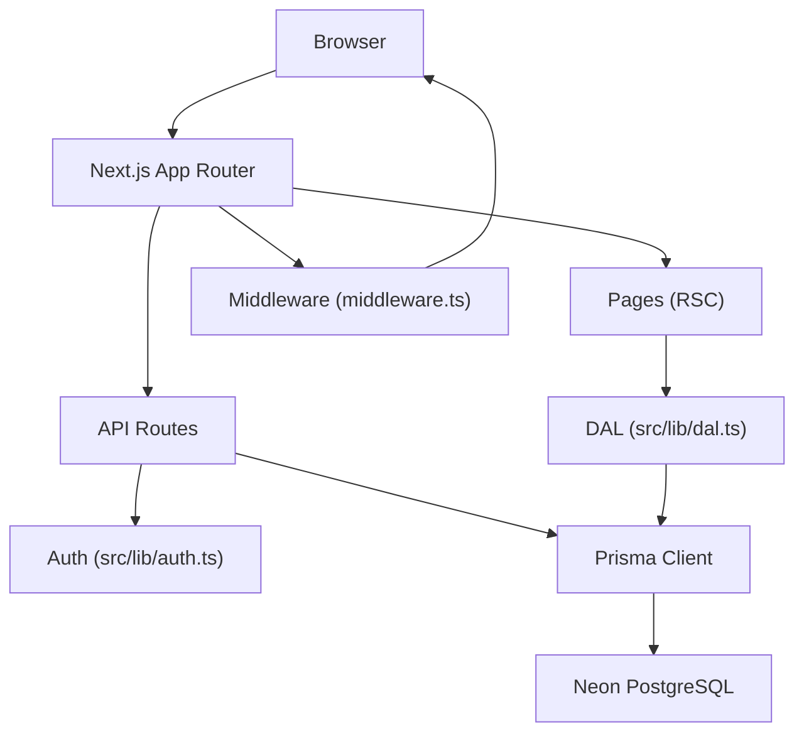
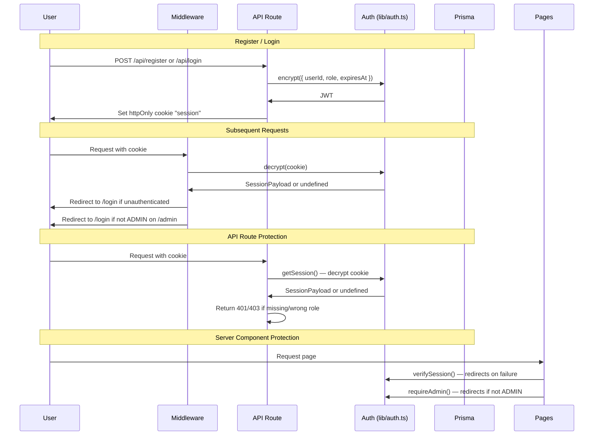
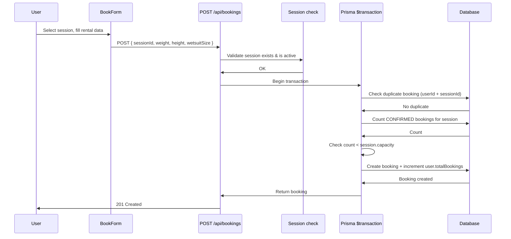
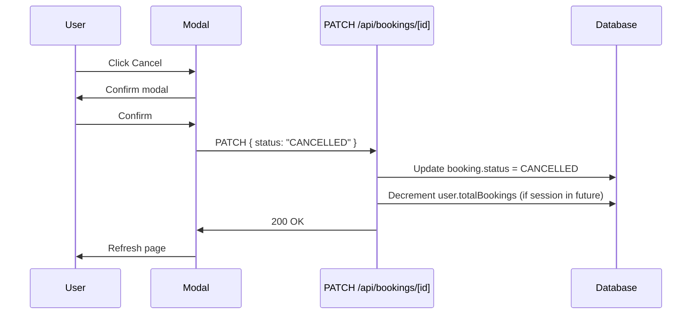
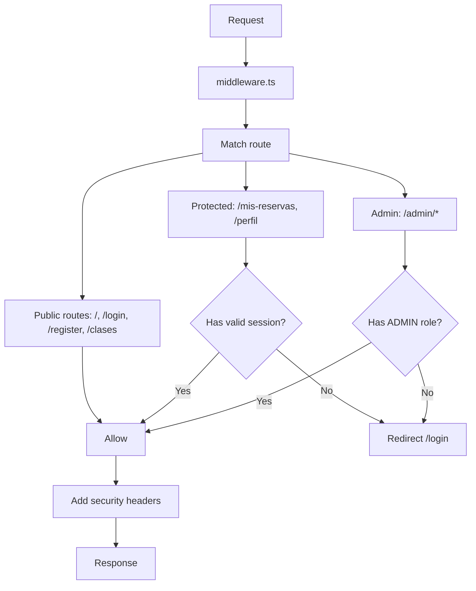
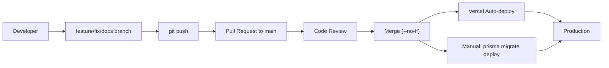

# Architecture

## Overview



## Layered Architecture

```
React/UI (Server & Client Components)
    |
    v
API Routes (Route Handlers)
    |
    v
Services / Business Logic (in API routes or lib/)
    |
    v
Data Access Layer (src/lib/dal.ts)
    |
    v
Prisma Client (src/lib/prisma.ts)
    |
    v
Neon PostgreSQL (Serverless)
```

Strict separation:

- **Never** place complex business logic inside React components
- Components are only responsible for: rendering, user interaction, UI state management
- All logic must live in API routes or the data access layer

## Authentication Flow



## Booking Flow



The entire check-and-create sequence is atomic via `$transaction`. Two simultaneous requests for the same session cannot both succeed (race condition prevention).

## Cancel Flow



Admin cancel follows the same pattern via `PATCH /api/admin/bookings/[id]`. Admin hard delete via `DELETE /api/admin/bookings/[id]` does NOT decrement `totalBookings`.

## Folder Structure

```
/
├── ARCHITECTURE.md          # This file
├── AGENTS.md                # Development workflow rules
├── CHANGELOG.md             # Release history
├── middleware.ts            # Auth guard + security headers
├── docs/
│   ├── adr/                 # Architecture Decision Records
│   ├── API.md               # API documentation
│   ├── DATABASE.md          # Database documentation
│   ├── SECURITY.md          # Security checklist
│   └── architecture.md      # Legacy architecture doc
├── prisma/
│   ├── schema.prisma        # Database schema (4 models)
│   ├── migrations/          # Prisma migrations
│   └── config.ts            # Prisma config (direct URL)
├── scripts/
│   └── seed.ts              # Database seeder
├── src/
│   ├── app/
│   │   ├── api/             # Route handlers (22 endpoints)
│   │   ├── admin/           # Admin panel pages
│   │   ├── clases/          # Public class catalog
│   │   ├── login/           # Login page
│   │   ├── mis-reservas/    # User bookings page
│   │   ├── perfil/          # User profile page
│   │   ├── register/        # Registration page
│   │   ├── layout.tsx       # Root layout
│   │   ├── page.tsx         # Home page
│   │   ├── error.tsx        # Error boundary
│   │   ├── loading.tsx      # Global loading
│   │   └── not-found.tsx    # 404 page
│   ├── components/
│   │   ├── Navbar.tsx       # Navigation + admin badge
│   │   └── Footer.tsx       # Footer
│   └── lib/
│       ├── auth.ts          # JWT encrypt/decrypt/session
│       ├── dal.ts           # Data access layer helpers
│       ├── prisma.ts        # Prisma client singleton
│       ├── utils.ts         # Utilities
│       └── __tests__/       # Tests + mocks
├── vercel.json              # Vercel deployment config
├── vitest.config.ts         # Test runner config
└── package.json
```

## Middleware

`middleware.ts` runs on every non-API, non-static request.



Security headers added by middleware:

| Header | Value |
|--------|-------|
| `Strict-Transport-Security` | `max-age=63072000; includeSubDomains; preload` |
| `X-Frame-Options` | `DENY` |
| `X-Content-Type-Options` | `nosniff` |
| `Referrer-Policy` | `strict-origin-when-cross-origin` |

## API Layer

All 22 API endpoints follow Next.js App Router Route Handlers pattern.

General pattern:

1. Extract session from cookie via `getSession()` from `@/lib/auth`
2. Return 401/403 JSON if unauthenticated/unauthorized
3. Parse and validate request body
4. Execute Prisma operations
5. Return JSON response

## Data Layer

```
User ──1:N──> Booking ──N:1──> Session ──N:1──> Class
```

- **User**: Registered students and admins. Stores profile data and `totalBookings` counter.
- **Class**: Course template (title, price, type, capacity, duration).
- **Session**: Specific date/time instance of a class. One class can have many sessions.
- **Booking**: Connects a user to a session. Stores rental-specific data (weight, height, wetsuit).

## Deployment Flow



## Environment Variables

| Variable | Purpose | Used By |
|----------|---------|---------|
| `DATABASE_URL` | Pooled Neon connection string (Prisma + Neon adapter at runtime) | `src/lib/prisma.ts` |
| `DIRECT_URL` | Direct Neon connection string (Prisma CLI migrations) | `prisma.config.ts` |
| `SESSION_SECRET` | JWT signing key (min 32 chars, HS256) | `src/lib/auth.ts` |

## Main Design Principles

1. **Maintainability** — readable, documented, consistent code
2. **Simplicity** — the simplest working solution
3. **Security** — validation, auth, headers, injection prevention
4. **Scalability** — structure that grows without rewrites
5. **Clean code** — no dead code, no orphan imports, no stale comments
