# API Documentation

## Overview

```mermaid
graph TD
    C["Client"] --> AuthAPI["/api/auth/*"]
    C --> BookingsAPI["/api/bookings/*"]
    C --> ClassesAPI["/api/classes/*"]
    C --> ProfileAPI["/api/profile"]
    C --> AdminAPI["/api/admin/*"]
    AuthAPI --> Login["POST /api/login"]
    AuthAPI --> Register["POST /api/register"]
    AuthAPI --> Logout["POST /api/logout"]
    AuthAPI --> Me["GET /api/me"]
    BookingsAPI --> Create["POST /api/bookings"]
    BookingsAPI --> Cancel["PATCH /api/bookings/[id]"]
    ClassesAPI --> List["GET /api/classes"]
    ClassesAPI --> Detail["GET /api/classes/[id]"]
    ProfileAPI --> Get["GET /api/profile"]
    ProfileAPI --> Update["PATCH /api/profile"]
    AdminAPI --> ABookings["/api/admin/bookings/*"]
    AdminAPI --> AClasses["/api/admin/classes/*"]
    AdminAPI --> ASessions["/api/admin/sessions/*"]
    AdminAPI --> AUsers["/api/admin/users/*"]
    AdminAPI --> Notifications["GET /api/admin/notifications"]
```



## Authentication

### POST /api/register

Register a new user.

- **Auth:** None
- **Authorization:** None

**Request body:**
```json
{
  "name": "string (required)",
  "apellido1": "string (required)",
  "apellido2": "string (required)",
  "email": "string (required, valid email)",
  "password": "string (required, min 8 chars)",
  "phone": "string (required, exactly 9 digits)",
  "weight": "number (required, kg)",
  "height": "number (required, cm)",
  "wetsuitSize": "string (required, XS-XXL)"
}
```

**Response:** `201`
```json
{
  "id": "string",
  "name": "string",
  "email": "string",
  "role": "USER"
}
```

**Errors:**
- `400` — Missing fields, invalid email, password too short, invalid phone, email already exists
- `500` — Server error

**Notes:** Sets session cookie on success. Password hashed with bcrypt(12).

---

### POST /api/login

Authenticate an existing user.

- **Auth:** None
- **Authorization:** None

**Request body:**
```json
{
  "email": "string (required)",
  "password": "string (required)"
}
```

**Response:** `200`
```json
{
  "id": "string",
  "name": "string",
  "email": "string",
  "role": "string"
}
```

**Errors:**
- `400` — Missing fields
- `401` — Invalid credentials
- `500` — Server error

**Notes:** Sets session cookie on success. Uses bcrypt.compare for password verification.

---

### POST /api/logout

Clear the session cookie.

- **Auth:** Any
- **Authorization:** None

**Request body:** None

**Response:** `200`
```json
{
  "success": true
}
```

**Notes:** Deletes the "session" cookie.

---

### GET /api/me

Get the current authenticated user's session info.

- **Auth:** Required (cookie)
- **Authorization:** Any

**Response:** `200`
```json
{
  "userId": "string",
  "role": "string"
}
```

**Errors:**
- `401` — Not authenticated

---

## Bookings

### POST /api/bookings

Create a new booking.

- **Auth:** Required (cookie)
- **Authorization:** USER

**Request body:**
```json
{
  "sessionId": "string (required)",
  "weight": "number (optional, required if RENTAL)",
  "height": "number (optional, required if RENTAL)",
  "wetsuitSize": "string (optional, required if RENTAL)"
}
```

**Response:** `201`
```json
{
  "id": "string",
  "userId": "string",
  "sessionId": "string",
  "status": "CONFIRMED",
  "participants": 1
}
```

**Errors:**
- `400` — Missing sessionId, validation errors, missing rental fields
- `401` — Not authenticated
- `409` — Duplicate booking (already booked this session)
- `409` — Capacity exceeded ("No quedan plazas disponibles para la sesión seleccionada")
- `404` — Session not found or inactive

**Notes:** Uses `$transaction` for atomic capacity check and booking creation. Increments `user.totalBookings`. Pre-fills rental fields from user profile when `isRental`.

---

### PATCH /api/bookings/[id]

Cancel a booking (soft cancel).

- **Auth:** Required (cookie)
- **Authorization:** Must own the booking

**Request body:**
```json
{
  "status": "CANCELLED"
}
```

**Response:** `200`
```json
{
  "id": "string",
  "status": "CANCELLED",
  "userId": "string",
  "sessionId": "string"
}
```

**Errors:**
- `401` — Not authenticated
- `403` — Not the owner
- `404` — Booking not found
- `400` — Booking already cancelled

**Notes:** Soft cancel (status change, not deletion). Decrements `user.totalBookings`. Uses `$transaction`.

---

## Classes

### GET /api/classes

List all active classes with their sessions.

- **Auth:** None
- **Authorization:** None

**Response:** `200`
```json
[
  {
    "id": "string",
    "title": "string",
    "description": "string",
    "type": "GROUP | INDIVIDUAL | RENTAL",
    "capacity": "number",
    "price": "number",
    "duration": "number",
    "isActive": true,
    "sessions": [
      {
        "id": "string",
        "date": "ISO date",
        "time": "string"
      }
    ]
  }
]
```

**Notes:** Only returns active classes (`isActive: true`) with active sessions.

---

### GET /api/classes/[id]

Get a single active class with its active sessions.

- **Auth:** None
- **Authorization:** None

**Response:** `200`
```json
{
  "id": "string",
  "title": "string",
  "description": "string",
  "type": "string",
  "capacity": "number",
  "price": "number",
  "duration": "number",
  "isActive": true,
  "sessions": [
    {
      "id": "string",
      "date": "ISO date",
      "time": "string",
      "isActive": true
    }
  ]
}
```

**Errors:**
- `404` — Class not found or inactive

---

## Profile

### GET /api/profile

Get the current user's profile.

- **Auth:** Required (cookie)
- **Authorization:** Any authenticated user

**Response:** `200`
```json
{
  "id": "string",
  "name": "string",
  "apellido1": "string",
  "apellido2": "string",
  "email": "string",
  "phone": "string",
  "weight": "number",
  "height": "number",
  "wetsuitSize": "string",
  "role": "string"
}
```

**Errors:**
- `401` — Not authenticated

---

### PATCH /api/profile

Update the current user's profile.

- **Auth:** Required (cookie)
- **Authorization:** Any authenticated user

**Request body:**
```json
{
  "name": "string (optional)",
  "apellido1": "string (optional)",
  "apellido2": "string (optional)",
  "phone": "string (optional, 9 digits)",
  "weight": "number (optional, kg, min 0)",
  "height": "number (optional, cm, min 0)",
  "wetsuitSize": "string (optional, XS-XXL)"
}
```

**Response:** `200`
```json
{
  "id": "string",
  "name": "string",
  "apellido1": "string",
  "apellido2": "string",
  "email": "string",
  "phone": "string",
  "weight": "number",
  "height": "number",
  "wetsuitSize": "string"
}
```

**Errors:**
- `400` — Validation errors, invalid phone
- `401` — Not authenticated

**Notes:** Email is NOT editable. Uses `Math.max(0, ...)` on weight/height.

---

## Admin

### GET /api/admin/notifications

Get the count of CONFIRMED bookings for today.

- **Auth:** Required (cookie)
- **Authorization:** ADMIN

**Response:** `200`
```json
{
  "count": "number"
}
```

**Errors:**
- `403` — Not authorized

**Notes:** Used by Navbar badge (polling every 30s).

---

### GET /api/admin/users

List all registered users.

- **Auth:** Required (cookie)
- **Authorization:** ADMIN

**Response:** `200`
```json
[
  {
    "id": "string",
    "name": "string",
    "apellido1": "string",
    "apellido2": "string",
    "email": "string",
    "phone": "string",
    "weight": "number",
    "height": "number",
    "wetsuitSize": "string",
    "role": "string",
    "totalBookings": "number",
    "createdAt": "ISO date"
  }
]
```

---

### PATCH /api/admin/users/[id]

Update a user's data (admin only).

- **Auth:** Required (cookie)
- **Authorization:** ADMIN

**Request body:**
```json
{
  "name": "string (optional)",
  "apellido1": "string (optional)",
  "apellido2": "string (optional)",
  "phone": "string (optional, 9 digits)",
  "weight": "number (optional, min 0)",
  "height": "number (optional, min 0)",
  "wetsuitSize": "string (optional, XS-XXL)"
}
```

**Response:** `200`
```json
{
  "id": "string",
  "name": "string",
  "apellido1": "string",
  "apellido2": "string",
  "email": "string",
  "phone": "string",
  "weight": "number",
  "height": "number",
  "wetsuitSize": "string"
}
```

**Errors:**
- `403` — Not authorized
- `404` — User not found
- `400` — Validation errors

---

### DELETE /api/admin/users/[id]

Delete a user and all their bookings (admin only).

- **Auth:** Required (cookie)
- **Authorization:** ADMIN

**Response:** `200`
```json
{
  "success": true
}
```

**Errors:**
- `403` — Not authorized, or trying to delete an ADMIN
- `404` — User not found

**Notes:** Deletes all bookings for the user first (cascade), then deletes the user. Cannot delete ADMIN users.

---

### GET /api/admin/bookings

List all bookings with user and session info.

- **Auth:** Required (cookie)
- **Authorization:** ADMIN

**Response:** `200`
```json
[
  {
    "id": "string",
    "userId": "string",
    "sessionId": "string",
    "status": "CONFIRMED | CANCELLED",
    "participants": 1,
    "weight": "number | null",
    "height": "number | null",
    "wetsuitSize": "string | null",
    "createdAt": "ISO date",
    "user": { "name": "string", "email": "string", "phone": "string" },
    "session": {
      "date": "ISO date",
      "time": "string",
      "class": { "title": "string", "type": "string" }
    }
  }
]
```

---

### PATCH /api/admin/bookings/[id]

Cancel a booking as admin (soft cancel).

- **Auth:** Required (cookie)
- **Authorization:** ADMIN

**Request body:**
```json
{
  "status": "CANCELLED"
}
```

**Response:** `200`
```json
{
  "id": "string",
  "status": "CANCELLED",
  "userId": "string",
  "sessionId": "string"
}
```

**Errors:**
- `403` — Not authorized
- `404` — Booking not found
- `400` — Already cancelled

**Notes:** Decrements `user.totalBookings` only when status changes to CANCELLED.

---

### DELETE /api/admin/bookings/[id]

Hard delete a booking (admin only).

- **Auth:** Required (cookie)
- **Authorization:** ADMIN

**Response:** `200`
```json
{
  "success": true
}
```

**Errors:**
- `403` — Not authorized
- `404` — Booking not found

**Notes:** Does NOT decrement `user.totalBookings` (used for past bookings cleanup).

---

### GET /api/admin/classes

List all classes (including inactive).

- **Auth:** Required (cookie)
- **Authorization:** ADMIN

**Response:** `200`
```json
[
  {
    "id": "string",
    "title": "string",
    "description": "string",
    "type": "string",
    "capacity": "number",
    "price": "number",
    "duration": "number",
    "isActive": "boolean",
    "sessions": [
      {
        "id": "string",
        "date": "ISO date",
        "time": "string",
        "isActive": "boolean"
      }
    ]
  }
]
```

---

### POST /api/admin/classes

Create a new class.

- **Auth:** Required (cookie)
- **Authorization:** ADMIN

**Request body:**
```json
{
  "title": "string (required)",
  "description": "string (required)",
  "type": "GROUP | INDIVIDUAL | RENTAL (required)",
  "capacity": "number (required, min 1)",
  "price": "number (required, min 0)",
  "duration": "number (required, min 1)"
}
```

**Response:** `201`
```json
{
  "id": "string",
  "title": "string",
  "type": "string"
}
```

**Errors:**
- `400` — Missing or invalid fields
- `403` — Not authorized

---

### PATCH /api/admin/classes/[id]

Update a class.

- **Auth:** Required (cookie)
- **Authorization:** ADMIN

**Request body:**
```json
{
  "title": "string (optional)",
  "description": "string (optional)",
  "type": "string (optional)",
  "capacity": "number (optional)",
  "price": "number (optional)",
  "duration": "number (optional)",
  "isActive": "boolean (optional)"
}
```

**Response:** `200`
```json
{
  "id": "string",
  "title": "string",
  "isActive": "boolean"
}
```

**Errors:**
- `400` — Cannot deactivate if active bookings exist
- `403` — Not authorized
- `404` — Not found

---

### GET /api/admin/sessions

List all sessions.

- **Auth:** Required (cookie)
- **Authorization:** ADMIN

**Response:** `200`
```json
[
  {
    "id": "string",
    "classId": "string",
    "date": "ISO date",
    "time": "string",
    "isActive": "boolean",
    "class": { "title": "string" }
  }
]
```

---

### POST /api/admin/sessions

Create a new session.

- **Auth:** Required (cookie)
- **Authorization:** ADMIN

**Request body:**
```json
{
  "classId": "string (required)",
  "date": "ISO date (required)",
  "time": "string (required, HH:mm)"
}
```

**Response:** `201`
```json
{
  "id": "string",
  "classId": "string",
  "date": "ISO date",
  "time": "string"
}
```

**Errors:**
- `400` — Missing fields
- `403` — Not authorized
- `404` — Class not found

---

### PATCH /api/admin/sessions/[id]

Update a session.

- **Auth:** Required (cookie)
- **Authorization:** ADMIN

**Request body:**
```json
{
  "date": "ISO date (optional)",
  "time": "string (optional)",
  "isActive": "boolean (optional)"
}
```

**Response:** `200`
```json
{
  "id": "string",
  "classId": "string",
  "date": "ISO date",
  "time": "string",
  "isActive": "boolean"
}
```

**Errors:**
- `400` — Cannot deactivate if active bookings exist
- `403` — Not authorized
- `404` — Not found

---

## Summary

| Method | URL | Auth | Role |
|--------|-----|------|------|
| POST | /api/register | No | — |
| POST | /api/login | No | — |
| POST | /api/logout | Any | — |
| GET | /api/me | Yes | Any |
| POST | /api/bookings | Yes | USER |
| PATCH | /api/bookings/[id] | Yes | Owner |
| GET | /api/classes | No | — |
| GET | /api/classes/[id] | No | — |
| GET | /api/profile | Yes | Any |
| PATCH | /api/profile | Yes | Any |
| GET | /api/admin/notifications | Yes | ADMIN |
| GET | /api/admin/users | Yes | ADMIN |
| PATCH | /api/admin/users/[id] | Yes | ADMIN |
| DELETE | /api/admin/users/[id] | Yes | ADMIN |
| GET | /api/admin/bookings | Yes | ADMIN |
| PATCH | /api/admin/bookings/[id] | Yes | ADMIN |
| DELETE | /api/admin/bookings/[id] | Yes | ADMIN |
| GET | /api/admin/classes | Yes | ADMIN |
| POST | /api/admin/classes | Yes | ADMIN |
| PATCH | /api/admin/classes/[id] | Yes | ADMIN |
| GET | /api/admin/sessions | Yes | ADMIN |
| POST | /api/admin/sessions | Yes | ADMIN |
| PATCH | /api/admin/sessions/[id] | Yes | ADMIN |
