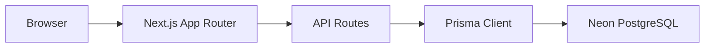

# Architecture (Legacy)

> **Note:** The comprehensive architecture documentation has moved to [`ARCHITECTURE.md`](../ARCHITECTURE.md) at the project root.
>
> This file is kept for backward compatibility. Please refer to the root document for the complete, up-to-date architecture description.
>
> Key sections in `ARCHITECTURE.md`:
> - High-level architecture (Mermaid diagrams)
> - Layered architecture
> - Folder structure
> - Authentication flow
> - Booking flow
> - Cancel flow
> - Middleware
> - API layer
> - Data layer
> - Deployment flow
> - Environment variables
> - Design principles

## Quick Reference



## Data Model

```
User ──1:N──> Booking ──N:1──> Session ──N:1──> Class
```

## Auth Pattern

- **API routes:** `getSession()` from `@/lib/auth`
- **Server components:** `verifySession()` or `requireAdmin()` from `@/lib/dal`
